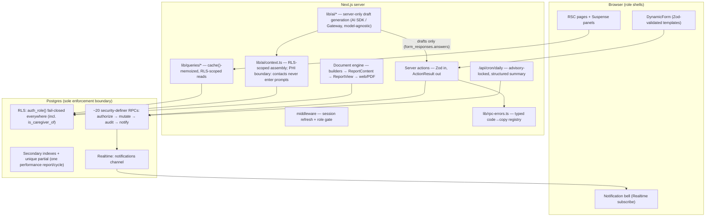

# PHLOEM Elevation Blueprint

> Strategic document. The executable companion is **`docs/ELEVATION_EXECUTION_PLAN.md`** — that file, not this one, is what an implementing agent follows step by step.

**Confirmed constraints (owner, 2026-07-19):** production pilot soon (security/correctness first) · AI is the product direction (Tier 3) · lightweight CI only (no heavy E2E/visual-regression infra).

**House rules binding all work** (from `CLAUDE.md`): every schema change is a numbered migration file in `supabase/migrations/` (next free: `0010`) applied via Supabase MCP `apply_migration` — never ad-hoc `execute_sql` schema changes; RLS + security-definer RPCs stay the sole enforcement boundary; service-role key server-only; TypeScript strict + Zod on all server-action inputs; npm; §16 RLS suite re-run after every migration; Asia/Kolkata timezone everywhere.

---

## Executive summary — top 5 highest-leverage moves

1. **Correctness/hardening migrations `0010`–`0012`** — fixes the verified H-1 bug (an unchanged doctor review stores `clearance: ""`, which the trainer gate at `0003_rpcs.sql:295-302` reads as "no clearance", permanently blocking trainer submissions), makes suspend a true DB lockout for caregivers (S-2: `is_caregiver_of` at `0002_rls.sql:18-21` ignores `profiles.status`), closes the double-performance-report race with a unique partial index (M-1), makes cycle rollover idempotent (M-2), fixes UTC-vs-IST resume math (M-3), and adds the entirely absent secondary indexes plus a cron advisory lock (M-4).
2. **Typed RPC error contract** — the database already emits uniform snake_case exception codes; the app parses them as prose (`error.message.includes("not_allowed")` in `app/(app)/program-actions.ts:17-27` and `app/(app)/clinician/clients/[id]/actions.ts:31-37,55`). One registry (`lib/rpc-errors.ts`) with an exhaustiveness test deletes the brittlest coupling in the app.
3. **Lightweight CI + test promotion** — one GitHub Actions workflow (tsc/lint/unit always; RLS suite when a DB secret exists), then `scripts/advance-demo.ts` — which already drives real RPCs through a full simulated month — reborn as an asserting lifecycle test: permanent regression armor for the cycle engine.
4. **Data-access layer with `React.cache()`** — collapses the `profiles` role lookup fetched ~5×/request and the doctor report fetched 3×/render on the clinician page; becomes the single seam that Suspense streaming *and* AI context assembly both consume.
5. **AI-drafted clinical assessments** (flagship, Tier 3) — `generateObject` against the Zod-validated form-template schema, landing in the *existing* draft row (`form_responses.answers`), edited by the clinician in DynamicForm, submitted through the unchanged `submit_clinical_form` RPC: maximum differentiation with **zero new write paths inside the trust boundary**.

**Recommended start:** CI (~1 hour), then migration `0010` the same day — H-1 breaks the core monthly loop the moment any doctor files one unchanged review, which will happen in the first review cycle of a pilot.

---

## 1 · How this system actually works today

PHLOEM is a spec-driven, database-enforced healthcare workflow system. Every request passes middleware (session refresh + `profiles` role lookup, `middleware.ts:6-86`) into role-prefixed App Router segments; pages are fully dynamic RSCs querying through an anon RLS-scoped client. All authorization lives in Postgres: 13 tables under per-role RLS keyed on fail-closed helpers (`auth_role()` returns NULL when suspended → every policy denies, `0002_rls.sql:6-10`), ~20 security-definer RPCs implementing every workflow transition with a uniform authorize → mutate → `_audit` → `_notify` contract, and dedupe-keyed notifications making the time-driven layer idempotent. A daily cron (`run_daily_jobs`, `0006_cycle_jobs.sql:213-363`) drives 30-day cycles from `end_date` offsets with dev-only time-travel. Forms are 10 versioned JSON templates rendered by one `DynamicForm`; submissions build `ReportContent` jsonb in TS, persisted atomically by RPC, rendered by one `ReportView` into both web and puppeteer PDF behind an RLS read-as-access-gate.

The app layer is deliberately thin and trusting (it never re-checks authorization) but pays with per-request duplication (role lookup ×5, doctor-report fetch ×3 on one page), two error dialects string-matching Postgres exception text, no Suspense/streaming/caching, and near-zero automated tests outside the excellent 57-assertion read-side RLS suite (`supabase/tests/rls.test.sql`). Verification culture is strong but manual: RLS suite via MCP, puppeteer screenshot audits (`scripts/design-audit.ts`), demo scripts that drive real RPCs — none wired into CI.

## 2 · Potential map

### Latent strengths → amplification

| Strength | Where | Becomes |
|---|---|---|
| Fail-closed `auth_role()` (suspended ⇒ NULL ⇒ deny) | `0002_rls.sql:6-10` | Extended to `is_caregiver_of` → "suspend = instant lockout" universally true (closes S-2) |
| Dedupe-key idempotency | `_notify` in `0003`/`0006` | Same pattern (unique partial index + on-conflict) kills the M-1 race; advisory lock completes cron concurrency |
| ReportContent + one ReportView → web *and* PDF | `lib/reports/*`, `components/reports/ReportView.tsx` | General document engine: AI summaries, coordinator briefs = new builders, zero new rendering code |
| DynamicForm JSON-schema split | `components/forms/*`, `supabase/templates/` | Zod-parsed validated contract = the exact target schema for AI `generateObject` |
| Red-flag TS↔SQL mirror + parity tests | `lib/red-flags.ts` ↔ `_red_flags()` | Canonical mirror convention, reused for clearance resolution and the error registry |
| RPC-driving demo scripts | `scripts/advance-demo.ts` | Lifecycle integration test with assertions, nearly for free |
| Thin trusting app layer, tiny service-role surface (4 call sites) | actions/*, `lib/supabase/admin.ts` | Any new surface — AI included — inherits authorization from RLS by construction |

### Elevation axes (current → gap)

- **Architecture:** role lookup duplicated ~5×/request (`middleware.ts:44-48`, `app/(app)/layout.tsx:31-36`, clinician/portal pages, login); no `React.cache()` anywhere.
- **Performance:** zero secondary indexes beyond `one_active_per_role` (`0001_init.sql:87`) while RLS runs per-row `exists`; no Suspense — the slowest of up to ~9 sequential queries blocks the whole page.
- **Correctness:** H-1 (`lib/reports/build/clinical.ts:165,198` vs gate `0003_rpcs.sql:295-302`); M-1 compile race (check-then-insert, no constraint); M-2 non-idempotent `close_cycle_open_next` (`0003:452-480` re-inserts 4 consults); M-3 UTC day math in `resume_program` (`0003:429`); prose-matched error codes.
- **Testing:** read-side-only RLS suite; no write-path/RPC-authorization or cycle-engine tests; no CI (`.github/workflows` absent).
- **Observability:** cron summary discarded; `notifications/actions.ts` swallows errors; no error tracking; one bad member aborts a whole cron run.
- **Security posture:** S-2 (suspended caregiver not DB-locked-out), S-3 (`fr_own_clinical` no `WITH CHECK`), S-4 (`notif_own` not status-aware).

## 3 · North-star design

**Flow (unchanged externally):** request → middleware → role-segment RSC → `lib/queries/*` (memoized, RLS-scoped, streamed per Suspense panel) → server actions returning one typed result via the RPC-error registry → RPCs (sole writers) → audit + dedupe-keyed notify → Realtime pushes the bell. Cron takes an advisory lock, runs six jobs, emits a structured summary that later also feeds the AI coordinator brief. AI reads via the caller's RLS client through PHI-bounded context assembly, writes only drafts; humans sign; RPCs commit.

### Key decisions (trade-off consciously accepted)

1. **Postgres stays the sole enforcement boundary — AI included.** (More PL/pgSQL, migrations for RPC changes → every surface inherits authorization; AI cannot leak what its RLS client cannot read.)
2. **RPC snake_case exception codes promoted to a frozen typed contract.** (Codes become a public API needing an exhaustiveness test → uniform error UX; deletes all `message.includes()` coupling.)
3. **Per-request `React.cache()` + Suspense; NO cross-request caching of PHI.** (Forgo `unstable_cache` wins → stale-PHI bugs impossible. Rejected: JWT role claim — would delay suspend-lockout until token expiry, weakening the S-2 fix.)
4. **Tests promoted, not invented.** RLS suite grows write-path assertions; `advance-demo.ts` becomes `test:lifecycle`; CI runs DB jobs only when `SUPABASE_DB_URL` secret exists. (Shared-dev-project isolation via rolled-back transactions and namespaced fixtures → H-1/S-2/M-1/M-2 become permanent regressions.)
5. **Form templates become a validated richer contract** (Zod at load, composable `showIf`, validation vocabulary, shared `useAutosaveDraft`). (Malformed template = hard load error → the template *is* the AI output schema.)
6. **Reports generalize to a builder registry + additive `plain_language` section kind.** (ReportContent becomes a semi-public, additive-only schema → new document types with zero renderer/PDF work.)
7. **AI is draft-only, human-signed, PHI-minimized.** Reads via the caller's RLS client + `get_onboarding_scoped` (the DB's own role-scoping scopes the prompts); `member_contacts` structurally absent from context assembly (mirroring the §4 onboarding split); outputs land in existing draft rows; submission through unchanged RPCs; every generation audited; `AI_ENABLED` kill-switch. (No autonomous AI, review friction → pilot-safe AI that survives an audit.)
8. **Lightweight CI only** — one workflow; the puppeteer design-audit stays a local pre-release ritual.

### Non-goals

No ORM/tRPC/framework migration; no cross-request PHI cache or `revalidateTag` architecture; no JWT-claims auth refactor; no heavy E2E or visual-regression CI; no AI writes outside draft rows and no auto-submitted clinical content, ever; no vendor lock (`lib/ai/provider.ts` seam — Vercel AI SDK / AI Gateway, Anthropic models env-selected).

## 4 · Roadmap

### Tier 1 — hours–days, low risk (pilot-blocking correctness + hardening)

Fully specified, step-by-step with complete code, in **`docs/ELEVATION_EXECUTION_PLAN.md`**. Summary:

| # | Item | Migration | Effort | Impact | Verification |
|---|---|---|---|---|---|
| T1.1 | CI workflow (tsc/lint/unit; RLS job secret-gated) | — | S | 8 | intentional type error → red |
| T1.2 | H-1 gate fix + M-1 unique index + M-2 idempotent rollover + M-3 IST resume | `0010_correctness.sql` | M | 10 | time-travel replay: unchanged review → trainer still unlocked; double-compile → 1 report; double-close → 4 consults |
| T1.3 | TS clearance pairing: builder omits empty clearance; shared `resolveClearance` mirror + parity test | — | S | 9 | `test:unit` parity; UI lock matches DB gate |
| T1.4 | S-2/S-3/S-4 fail-closed owners | `0011_fail_closed_owners.sql` | S | 9 | §16 suite + new suspended-caregiver assertions |
| T1.5 | Hot-path indexes + cron advisory lock | `0012_hot_path_indexes.sql` | S | 8 | `explain analyze` seq→index; concurrent cron → no dupes; advisors clear |
| T1.6 | Typed RPC error registry + consumers + exhaustiveness test | — | S–M | 7 | unit test greps migrations for codes |
| T1.7 | H-3: `set_report_sharing` RPC + admin toggle | `0013_report_sharing.sql` | M | 8 | §16: caregiver 0 → 1 → 0 across toggle |
| T1.8 | `React.cache()` session-profile + doctor-report dedupe | — | S | 6 | 1 profile query/request in dev log |

Types are regenerated after every migration via MCP `generate_typescript_types` → `lib/supabase/database.types.ts`; the §16 suite re-runs after every migration.

### Tier 2 — days–weeks, structural elevation

- **T2.1 Data-access layer** `lib/queries/{session,members,cycles,reports,consultations}.ts` — `cache()`-wrapped RLS-scoped reads; drains the duplication table (eligibility calc ×2, status-label dicts ×3, `pkg ? cycles : []` ×3, FK-shape coercion ×3, IST day math ×2 → fold into `lib/datetime.ts`). L · impact 8 · one page per PR under CI. Verify: build + `scripts/shot-one.ts` spot diffs; behavior identical.
- **T2.2 Suspense streaming** (needs T2.1) — panel-level `<Suspense>` on the coordinator member and clinician client pages. M · 7. Verify: streamed flight chunks; TTFB drop measured with `next start` + curl.
- **T2.3 Forms engine v2** — Zod schema for `FormTemplateSchema` parsed at load (kills the `as unknown as` casts); additive `showIf` grammar (`{all|any}`, `in|gt|lt`); validation vocabulary (min/max/pattern) in DynamicForm + mirrored server Zod; `useAutosaveDraft` hook replacing 4 duplicated effects. L · 8. Verify: unit test parses all 10 checked-in templates; design-audit `--flow` renders identical.
- **T2.4 Unified `ActionResult<T>`** (after T1.6) — one result type; dialect-A actions keep redirect UX, derive flash codes from the registry. M · 6.
- **T2.5 Test promotion** (after T1.2/T1.5) — write-path RLS section (RPC authorization guards) + `scripts/test-lifecycle.ts` from `advance-demo.ts`: ephemeral member, full simulated month, asserts cycle math / single performance report / idempotent reruns / clearance carry-forward, then teardown; CI optional DB job. M–L · 9. Verify: deliberate H-1 revert on a branch → red.
- **T2.6 Realtime notifications** — migration `alter publication supabase_realtime add table notifications`; bell subscribes `postgres_changes` filtered by `user_id`, poll fallback kept. M · 6.
- **T2.7 Observability floor** — structured JSON log line in the cron route; per-member exception handling in Job 4 (one bad member no longer aborts the run; failures in the summary); `lib/notify.ts` failure logging; minimal error tracking (Sentry or a 20-line lib — decide at implementation). M · 7.
- **T2.8 Document-engine generalization** (prereq for T3.3/T3.4) — builder registry `lib/reports/build/index.ts`; additive `plain_language` section kind in types/ReportView/styles. M · 6. Verify: existing report types render byte-identical (HTML snapshot).

### Tier 3 — AI evolution (draft-only, human-signed, PHI-minimized)

**Rules for all Tier-3 work:** AI code server-only under `lib/ai/`; reads via the **caller's RLS client** (never the admin client); context assembly has no `member_contacts` query — structural exclusion, mirroring the §4 split; prompts use `get_onboarding_scoped` so each role's AI sees only what that role sees; every generation audited (`ai.draft_created` via a small RPC); outputs are drafts; RPCs stay the sole committers; `AI_ENABLED` env kill-switch; provider seam `lib/ai/provider.ts` (Vercel AI SDK / AI Gateway, Anthropic models env-selected — e.g. a Sonnet-class model for drafting).

- **T3.1 AI foundation** (needs T2.1) — provider seam + `lib/ai/context.ts` PHI-bounded assembler + `log_ai_generation` RPC (migration `0015_ai_audit.sql`). M · 7. Verify: unit test asserts assembled context contains no §4 strip-list key (`contact_number`, `pin_code`, emergency fields); audit row per generation.
- **T3.2 AI-drafted clinical assessments** (needs T3.1 + T2.3) — "Draft with AI" on the clinician form panel: role-scoped context → `generateObject` with the Zod template schema → result written into the **existing draft row** (`form_responses.answers`, tagged `_ai_drafted: true`) → clinician edits in DynamicForm → submits through unchanged `submit_clinical_form` (all gates still enforce). Persistent "AI-drafted — review required" banner until first human edit. L · 9 — the flagship. Verify: a trainer's draft request cannot elicit doctor-scoped data; audit row present; unedited and edited submits both flow through the RPC.
- **T3.3 Caregiver plain-language summaries** (needs T3.1 + T2.8 + T1.7) — at share time, generate a `plain_language` section from the report's structured `ReportContent` (the document *is* the prompt input); human preview/edit mandatory before commit; immutability preserved. M–L · 8. Verify: RLS share assertions; PDF renders the section; prompt input = ReportContent only.
- **T3.4 Coordinator daily brief** (needs T3.1 + T2.7) — cron's structured summary → short prioritized brief inserted as a normal dedupe-keyed notification (`brief:{date}:{coordinator}`), delivered via Realtime. M · 6. Verify: exactly one brief per coordinator per simulated day; rerun = no duplicate.

**Tier-3 sequencing:** T3.1 → T3.2 → T3.3 → T3.4.

## 5 · Living-document rule

If reality diverges during execution, the executing agent updates this blueprint **and** the execution plan in the same commit as the divergence. These documents must always reflect the truth of the codebase.
